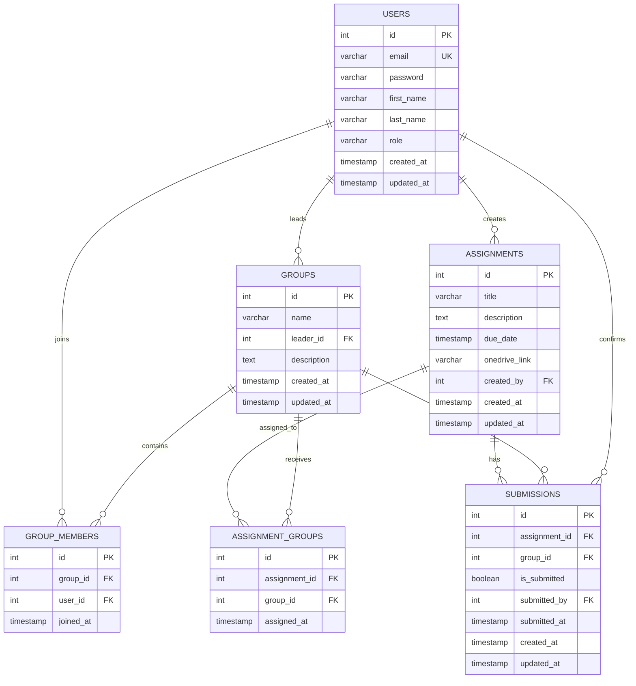

# Joineazy Assignment System

A full-stack web application for managing students, groups, assignments, assignment distribution, submission confirmations, and progress analytics.

## Project Overview

Joineazy Assignment System is built for an educational workflow where students work in groups and professors/admins manage assignments and monitor progress.

### Student Features

- Register and log in
- Create student groups
- Add group members using student email
- View group details and members
- View assignments assigned to the student's groups
- Open OneDrive assignment links
- Confirm an assignment submission through a two-step confirmation flow
- View submission status and group progress

### Admin / Professor Features

- Log in using an admin account
- View dashboard statistics
- Create assignments
- Edit assignments
- Delete assignments
- Set assignment title, description, due date, and OneDrive link
- Assign assignments to specific groups
- Monitor group and student progress
- View analytics for groups and students

---

## Technology Stack

### Frontend

- React.js 18
- Create React App (`react-scripts`)
- React Router
- Tailwind CSS 3.3
- Axios
- React Context API

### Backend

- Node.js 18
- Express.js
- PostgreSQL
- `pg` (node-postgres)
- JWT authentication
- bcryptjs password hashing
- CORS
- REST APIs

### DevOps

- Docker
- Docker Compose
- PostgreSQL Docker image

### Development Tools

- Git / GitHub
- npm
- Postman / Thunder Client
- VS Code

---

## System Architecture

```text
                         ┌──────────────────────────┐
                         │       Web Browser        │
                         │      React + Tailwind    │
                         └────────────┬─────────────┘
                                      │
                                HTTP REST API
                                + JWT Token
                                      │
                         ┌────────────▼─────────────┐
                         │      Node.js / Express    │
                         │                           │
                         │ Routes                    │
                         │ Controllers               │
                         │ Services                  │
                         │ JWT Middleware            │
                         │ Role Middleware            │
                         └────────────┬─────────────┘
                                      │
                                  SQL / pg
                                      │
                         ┌────────────▼─────────────┐
                         │       PostgreSQL          │
                         │                           │
                         │ users                     │
                         │ groups                    │
                         │ group_members             │
                         │ assignments               │
                         │ assignment_groups         │
                         │ submissions               │
                         └───────────────────────────┘

                 Docker Compose manages all three services:
                    Frontend + Backend + PostgreSQL
```

### Request Flow

```text
React Page
   ↓
Axios API Client
   ↓
Express Route
   ↓
JWT Authentication / Role Authorization
   ↓
Controller
   ↓
Service / PostgreSQL Query
   ↓
JSON Response
   ↓
React UI Update
```

---

## Authentication and Authorization

The application uses JWT-based authentication.

### Registration

New users are registered as students by default.

```text
POST /api/auth/register
```

### Login

After successful login, the backend returns a JWT and user information.

```text
POST /api/auth/login
```

The frontend stores the authentication token and sends it with protected API requests:

```text
Authorization: Bearer <JWT_TOKEN>
```

### Roles

The application supports:

- `student`
- `admin`

Public registration creates a student account. Admin accounts are managed separately rather than allowing unrestricted public admin registration.

---

## Database Schema

PostgreSQL is used as the relational database.

### Tables

1. `users` - Authentication and user profile information
2. `groups` - Student groups
3. `group_members` - Group membership relationship
4. `assignments` - Assignment information
5. `assignment_groups` - Assignment-to-group relationship
6. `submissions` - Group assignment submission confirmations

### Entity Relationship Diagram



### Important Relationships

- One user can lead multiple groups.
- One group can contain multiple students.
- Students and groups are connected through `group_members`.
- One admin can create multiple assignments.
- Assignments and groups are connected through `assignment_groups`.
- Each assignment/group combination has one submission record.
- `submitted_by` records the student who confirmed the submission.

---

## API Documentation

### Base URL

```text
http://localhost:5000/api
```

### Authentication Header

Protected endpoints use:

```text
Authorization: Bearer <JWT_TOKEN>
```

### Authentication APIs

| Method | Endpoint | Purpose |
|---|---|---|
| POST | `/auth/register` | Register a student |
| POST | `/auth/login` | Login |
| GET | `/auth/me` | Get current authenticated user |

### Group APIs

| Method | Endpoint | Purpose |
|---|---|---|
| POST | `/groups` | Create a group |
| GET | `/groups` | Get groups |
| GET | `/groups/:id` | Get group details |
| GET | `/groups/my-groups` | Get groups for current student |
| POST | `/groups/:id/members` | Add a member by email |
| DELETE | `/groups/:id/members/:studentId` | Remove a member |

### Assignment APIs

| Method | Endpoint | Purpose |
|---|---|---|
| POST | `/assignments` | Create an assignment |
| GET | `/assignments` | Get assignments |
| GET | `/assignments/:id` | Get assignment details |
| PUT | `/assignments/:id` | Update an assignment |
| DELETE | `/assignments/:id` | Delete an assignment |
| POST | `/assignments/:id/groups` | Assign an assignment to a group |
| GET | `/assignments/:id/groups` | Get groups assigned to an assignment |
| GET | `/assignments/group/:groupId` | Get assignments for a group |

### Submission APIs

| Method | Endpoint | Purpose |
|---|---|---|
| POST | `/submissions/:assignmentId/confirm` | Confirm assignment submission |
| GET | `/submissions` | Get submissions |
| GET | `/submissions/:assignmentId/:groupId` | Get submission status |
| GET | `/submissions/group/:groupId` | Get group submissions |
| GET | `/submissions/assignment/:assignmentId` | Get assignment submissions |

### Analytics APIs

Admin-only analytics endpoints:

| Method | Endpoint | Purpose |
|---|---|---|
| GET | `/analytics/overview` | Dashboard overview statistics |
| GET | `/analytics/groups` | Group progress analytics |
| GET | `/analytics/students` | Student progress analytics |
| GET | `/analytics/assignments` | Assignment statistics |
| GET | `/analytics/assignments/:assignmentId` | Detailed assignment statistics |

---

## Two-Step Submission Confirmation

The student submission flow is designed to reduce accidental confirmation.

```text
Student opens assignment
        ↓
Clicks "Yes, I have submitted"
        ↓
Confirmation modal appears
        ↓
Student confirms
        ↓
POST /api/submissions/:assignmentId/confirm
        ↓
Backend validates authentication and group membership
        ↓
Submission record is created/updated
        ↓
Assignment becomes "Submitted"
        ↓
Group progress is updated
```

---

## Folder Structure

```text
joineazy-assignment-system/
│
├── backend/
│   ├── src/
│   │   ├── config/
│   │   │   └── db.js
│   │   ├── controllers/
│   │   │   ├── authController.js
│   │   │   ├── groupController.js
│   │   │   ├── assignmentController.js
│   │   │   ├── submissionController.js
│   │   │   └── analyticsController.js
│   │   ├── middleware/
│   │   │   ├── authMiddleware.js
│   │   │   └── roleMiddleware.js
│   │   ├── routes/
│   │   │   ├── authRoutes.js
│   │   │   ├── groupRoutes.js
│   │   │   ├── assignmentRoutes.js
│   │   │   ├── submissionRoutes.js
│   │   │   └── analyticsRoutes.js
│   │   ├── services/
│   │   │   ├── authService.js
│   │   │   ├── groupService.js
│   │   │   └── assignmentService.js
│   │   ├── utils/
│   │   │   └── jwt.js
│   │   ├── app.js
│   │   └── server.js
│   ├── package.json
│   ├── Dockerfile
│   └── .env
│
├── frontend/
│   ├── src/
│   │   ├── components/
│   │   │   ├── Navbar.jsx
│   │   │   ├── Sidebar.jsx
│   │   │   ├── AssignmentCard.jsx
│   │   │   ├── GroupCard.jsx
│   │   │   └── ConfirmModal.jsx
│   │   ├── pages/
│   │   │   ├── Login.jsx
│   │   │   ├── Register.jsx
│   │   │   ├── student/
│   │   │   │   ├── StudentDashboard.jsx
│   │   │   │   ├── MyGroup.jsx
│   │   │   │   └── Assignments.jsx
│   │   │   └── admin/
│   │   │       ├── AdminDashboard.jsx
│   │   │       ├── Assignments.jsx
│   │   │       ├── CreateAssignment.jsx
│   │   │       ├── EditAssignment.jsx
│   │   │       ├── Groups.jsx
│   │   │       └── Analytics.jsx
│   │   ├── services/
│   │   │   └── api.js
│   │   ├── context/
│   │   │   └── AuthContext.jsx
│   │   ├── routes/
│   │   │   └── ProtectedRoute.jsx
│   │   ├── App.jsx
│   │   └── index.css
│   ├── public/
│   │   └── index.html
│   ├── package.json
│   ├── tailwind.config.js
│   ├── postcss.config.js
│   └── Dockerfile
│
├── docker-compose.yml
├── README.md
└── .gitignore
```

---

## Quick Start

### Prerequisites

For Docker-based setup:

- Docker Desktop
- Git

For manual local development:

- Node.js 18+
- PostgreSQL 15+ recommended
- npm

---

## Run with Docker

From the project root:

```bash
docker compose up --build
```

The services are exposed as:

```text
Frontend:  http://localhost:3000
Backend:   http://localhost:5000
PostgreSQL: localhost:5432
```

### Check Running Containers

```bash
docker compose ps
```

### View Logs

```bash
docker compose logs -f
```

### View a Specific Service

```bash
docker compose logs -f backend
```

```bash
docker compose logs -f frontend
```

### Stop Containers

```bash
docker compose down
```

### Stop Containers and Remove Database Volume

Only use this when you intentionally want to reset the local database:

```bash
docker compose down -v
```

> Warning: `docker compose down -v` deletes the PostgreSQL Docker volume and therefore removes the stored local database data.

---

## Environment Variables

### Backend

Example development configuration:

```env
PORT=5000
NODE_ENV=development

DB_HOST=localhost
DB_PORT=5432
DB_USER=postgres
DB_PASSWORD=<your-password>
DB_NAME=joineazy_db

JWT_SECRET=<change-in-production>
JWT_EXPIRY=7d

FRONTEND_URL=http://localhost:3000
```

When the backend runs inside Docker Compose, the database host is the PostgreSQL service name:

```env
DB_HOST=postgres
DB_PORT=5432
DB_USER=joineazy_user
DB_PASSWORD=<docker-db-password>
DB_NAME=joineazy_db
```

### Frontend

Because the frontend uses Create React App:

```env
REACT_APP_API_URL=http://localhost:5000/api
REACT_APP_BACKEND_URL=http://localhost:5000
```

> Never commit real production secrets or passwords to GitHub.

---

## Database Initialization

The backend initializes the required PostgreSQL tables when the application starts.

The database contains:

```text
users
groups
group_members
assignments
assignment_groups
submissions
```

When using Docker Compose, PostgreSQL data is persisted in the named Docker volume:

```text
postgres_data
```

---

## Creating an Admin Account

Public registration creates student accounts by default.

For local testing, an existing account can be promoted to admin directly in PostgreSQL:

```sql
UPDATE users
SET role = 'admin'
WHERE email = 'admin@gmail.com';
```

Verify:

```sql
SELECT id, email, first_name, last_name, role
FROM users
WHERE email = 'admin@gmail.com';
```

After changing the role, log out and log in again so a new JWT containing the updated role is issued.

---

## Manual Development Setup

### Backend

```bash
cd backend
npm install
npm start
```

Backend:

```text
http://localhost:5000
```

### Frontend

Open another terminal:

```bash
cd frontend
npm install
npm start
```

Frontend:

```text
http://localhost:3000
```

For manual development, make sure PostgreSQL is running and the backend `.env` contains the correct local database credentials.

---

## Role-Based Access Control

The application uses both frontend route protection and backend authorization.

### Frontend

Protected routes verify whether the user is authenticated.

Role-specific routes ensure that:

```text
student → Student workspace
admin   → Admin workspace
```

### Backend

JWT middleware verifies the token.

Role middleware protects admin-only endpoints such as analytics and assignment administration.

This prevents users from accessing protected features only by changing frontend URLs.

---

## Key Design Decisions

### 1. React + Tailwind CSS

React provides reusable components and page-based UI composition. Tailwind CSS keeps styling close to the components and supports responsive layouts without maintaining a large collection of custom page-specific styles.

### 2. Express REST API

Express provides a lightweight API layer with separate routes, controllers, services, and middleware.

### 3. PostgreSQL

PostgreSQL is suitable for this application because the data contains strong relationships between users, groups, assignments, and submissions. Foreign keys and unique constraints help maintain data integrity.

### 4. JWT Authentication

JWT provides stateless authentication for the React frontend and Express backend.

### 5. Context API

React Context is sufficient for the application's global authentication state without adding the complexity of a larger state-management library.

### 6. Assignment-to-Group Join Table

The `assignment_groups` table separates assignment creation from assignment distribution and allows an assignment to be associated with specific groups.

### 7. Submission Record per Assignment and Group

The `submissions` table uses a unique `(assignment_id, group_id)` relationship so a group has one submission status for a particular assignment.

### 8. Docker Compose

Docker Compose provides a repeatable development environment containing:

```text
React frontend
Node/Express backend
PostgreSQL database
```

---

## Security

Implemented:

- Password hashing with bcryptjs
- JWT authentication
- JWT expiration
- Role-based authorization
- Protected API endpoints
- Parameterized PostgreSQL queries
- CORS configuration
- Foreign key constraints
- Unique database constraints
- Environment variables for configuration

### Production Security Improvements

For a production deployment, the following should also be considered:

- HTTPS/TLS
- Secure HTTP-only cookie-based token handling
- Rate limiting
- Security headers
- Strong production secrets
- Centralized logging and monitoring
- Database backups
- Secret management
- Dependency updates
- Input validation and sanitization

---

## Testing Checklist

### Student Flow

- [ ] Register student
- [ ] Login as student
- [ ] Create group
- [ ] Add another student to group
- [ ] View group members
- [ ] View assigned assignments
- [ ] Open OneDrive link
- [ ] Confirm submission
- [ ] Verify submitted status
- [ ] Verify group progress

### Admin Flow

- [ ] Login as admin
- [ ] View admin dashboard
- [ ] Create assignment
- [ ] Edit assignment
- [ ] Delete assignment
- [ ] Assign assignment to group
- [ ] View group analytics
- [ ] View student analytics
- [ ] Verify submission statistics

### Docker Flow

- [ ] `docker compose up --build`
- [ ] PostgreSQL becomes healthy
- [ ] Backend starts successfully
- [ ] Frontend starts successfully
- [ ] Frontend can communicate with backend
- [ ] Database data persists after container restart

---

## Current Docker Services

```text
┌─────────────────────────────────────────────┐
│              Docker Compose                 │
│                                             │
│  ┌──────────────┐    ┌──────────────┐       │
│  │   Frontend   │───▶│   Backend    │       │
│  │   React      │    │ Node/Express │       │
│  │   :3000      │    │    :5000     │       │
│  └──────────────┘    └──────┬───────┘       │
│                             │               │
│                      ┌──────▼───────┐       │
│                      │  PostgreSQL  │       │
│                      │    :5432     │       │
│                      └──────────────┘       │
└─────────────────────────────────────────────┘
```

---

## Known Limitations

The current implementation focuses on the core assignment workflow.

Current limitations include:

- OneDrive is handled through links rather than direct file upload.
- Email notifications are not implemented as a separate email service.
- Real-time WebSocket updates are not implemented.
- Advanced search/filtering is limited.
- Grading and teacher feedback workflows are outside the current scope.

### Possible Future Enhancements

- Email notifications
- Real-time notifications with Socket.io
- Direct cloud file integration
- Advanced assignment filtering
- Grading and feedback
- More detailed analytics visualizations
- Automated end-to-end testing
- CI/CD pipeline
- Production deployment

---

## Git Workflow

Recommended commit style:

```bash
git commit -m "feat(backend): implement JWT authentication"
git commit -m "feat(backend): add group management APIs"
git commit -m "feat(backend): add assignment management APIs"
git commit -m "feat(backend): add submission tracking"
git commit -m "feat(backend): add analytics APIs"
git commit -m "feat(frontend): implement student dashboard"
git commit -m "feat(frontend): implement admin dashboard"
git commit -m "feat(frontend): implement assignment management"
git commit -m "feat(frontend): implement group management"
git commit -m "style(frontend): improve responsive Tailwind UI"
git commit -m "fix(backend): correct group assignment progress"
git commit -m "docs: update project documentation"
```

---

## Deployment

### Development Deployment

The project is containerized using Docker Compose.

```bash
docker compose up --build
```

### Production Considerations

For production:

1. Use a managed PostgreSQL database or a properly secured PostgreSQL server.
2. Use a strong random JWT secret.
3. Configure production CORS origins.
4. Enable HTTPS.
5. Build the React application for production.
6. Run the backend with production environment variables.
7. Keep secrets outside Git.
8. Configure database backups.
9. Add monitoring and centralized logging.
10. Use a production reverse proxy where appropriate.

---

## Demo

### Local Demo

```text
Frontend: http://localhost:3000
Backend:  http://localhost:5000
```

### Submission Links

Add the final links before submitting the assignment:

```text
GitHub Repository: <add-github-repository-url>
Demo Video:        <add-demo-video-url>
Live Platform:    <add-live-platform-url-if-available>
```

---

## Project Status

The core assignment management workflow is implemented and tested locally with Docker:

- Student registration/login
- Admin login
- Group management
- Assignment management
- Group assignment distribution
- Submission confirmation
- Group progress tracking
- Admin analytics
- PostgreSQL persistence
- Dockerized frontend, backend, and database

---

## Author

**Sanwariya Lal Sukhwal**

- MCA — Mohanlal Sukhadia University, Udaipur
- Full Stack Development — Java / React / Node.js
- GitHub: https://github.com/Sanwariya-Sukhwal
- LinkedIn: https://www.linkedin.com/in/sanwariya02

---

## License

This project was developed for educational and internship assignment purposes as part of the Joineazy Full Stack Internship task.
